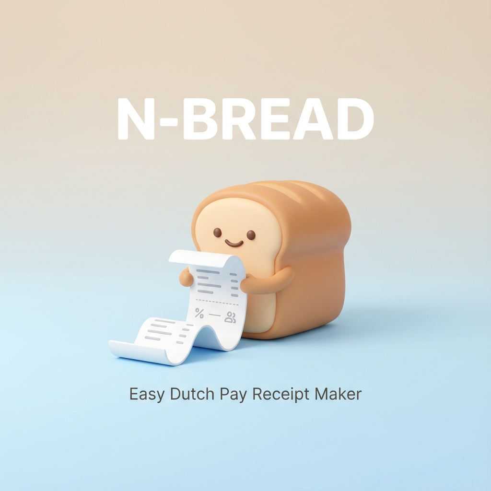

# 🧾 N-BREAD (엔빵)



<div align="center">

[](https://react.dev/)
[](https://www.typescriptlang.org/)
[](https://vitejs.dev/)
[](https://tailwindcss.com/)
[](https://firebase.google.com/)
[](./LICENSE)

**복잡한 더치페이 정산, 1초 만에 깔끔한 영수증으로 해결하세요.**  
친구들과의 모임, 여행, 회식 정산을 위한 웹 기반 간편 더치페이 영수증 생성기입니다.

[👉 웹사이트 바로가기 (n-bread.web.app)](https://n-bread.web.app/)

</div>

---

## 📌 주요 기능 (Features)

### 1. 간편한 입력 시스템
- **참여자 관리**: 인원 수에 제한 없이 자유롭게 참여자를 추가/삭제할 수 있습니다.
- **메뉴 관리**: 메뉴명과 가격을 입력하고, 해당 메뉴를 먹은 사람만 콕 집어 선택(Check)할 수 있습니다.

### 2. 똑똑한 자동 계산
- **1/N 분배**: 각 메뉴별로 n명의 참여자에게 정확히 나눈 금액을 계산합니다.
- **단위 절사**: 1원 단위, 10원 단위, 100원 단위 등 원하는 대로 절사/반올림 설정이 가능합니다. (올림/버림 지원)

### 3. 감성 영수증 생성 & 공유
- **디자인 테마**: Basic, Blueprint(청사진), Eco(친환경) 등 다양한 영수증 디자인을 제공합니다.
- **이미지 저장**: 생성된 영수증을 이미지 파일로 즉시 저장하여 카카오톡이나 SNS로 공유할 수 있습니다.
- **QR 코드**: 정산 받을 계좌주와 계좌번호를 입력하면, 입금용 QR코드가 포함된 영수증이 생성됩니다.

### 4. 사용자 친화적 환경 (UX)
- **설치 불필요**: 웹 브라우저에서 즉시 실행되는 가벼운 웹 애플리케이션입니다.
- **모바일 최적화**: PC는 물론 모바일 환경에서도 완벽하게 동작하는 반응형 디자인입니다.
- **데이터 보안**: 모든 데이터는 서버에 저장되지 않고 로컬 브라우저에만 임시 저장되어 안전합니다.

## 🛠 기술 스택 (Tech Stack)

| 구분 | 기술 | 설명 |
| :--- | :--- | :--- |
| **Frontend** | React 19, TypeScript | 컴포넌트 기반 UI 아키텍처 및 타입 안정성 확보 |
| **Build Tool** | Vite | 초고속 개발 서버 및 번들링 |
| **Styling** | Tailwind CSS | 유틸리티 퍼스트 CSS 프레임워크 |
| **State Management** | Zustand | 가볍고 직관적인 전역 상태 관리 |
| **Utilities** | html2canvas | DOM 요소를 이미지로 캡처 및 변환 |
| **Hosting** | Firebase Hosting | 빠르고 안정적인 정적 웹 호스팅 |
| **Analytics** | Google Analytics 4 | 사용자 행동 분석 및 트래픽 모니터링 |

## 🚀 시작하기 (Getting Started)

이 프로젝트를 로컬 환경에서 실행하려면 다음 단계가 필요합니다.

### 전제 조건
- Node.js (v18.0.0 이상 권장)
- npm 혹은 yarn

### 설치 및 실행

```bash
# 1. 저장소 클론
git clone https://github.com/your-username/dutch-n.git
cd dutch-n

# 2. 의존성 패키지 설치
npm install

# 3. 환경 변수 설정 (.env 파일 생성)
# Firebase 콘솔에서 발급받은 키를 입력하세요.
echo "VITE_FIREBASE_API_KEY=your_key" > .env
...

# 4. 개발 서버 실행
npm run dev
```

## 📁 프로젝트 구조 (Project Structure)

```
dutch-n/
├── public/              # 정적 자산 (이미지, 로봇, 사이트맵 등)
├── src/
│   ├── components/      # UI 컴포넌트 (입력폼, 영수증, 푸터 등)
│   ├── store/           # Zustand 상태 관리 스토어
│   ├── App.tsx          # 메인 앱 컴포넌트
│   ├── main.tsx         # 진입점 (Entry Point)
│   └── firebase.ts      # Firebase 설정 및 초기화
├── .firebaserc          # Firebase 프로젝트 설정
├── firebase.json        # Firebase 호스팅 설정
└── README.md            # 프로젝트 문서
```

## 🤝 기여하기 (Contributing)
이슈 제보와 풀 리퀘스트는 언제나 환영합니다. 버그를 발견하거나 새로운 기능을 제안하고 싶다면 Issue를 등록해주세요.

## 📄 라이선스 (License)
이 프로젝트는 MIT 라이선스 하에 배포됩니다. 자세한 내용은 [LICENSE](./LICENSE) 파일을 참고하세요.
